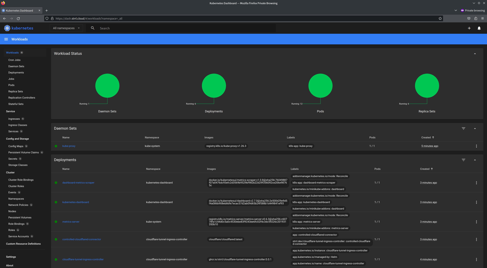

# Cloudflare Tunnel Ingress Controller

TLDR; This project simplifies exposing Kubernetes services to the internet easily and securely using Cloudflare Tunnel.

##  Fork

Currently a hardfork of the origin project. Following changes are available:

- [x] Hardened controller and tunnel deployment
- [x] Support Tunnel configuration via annotations
- [x] Always set HTTP Host Header for exposed ingresses (security measure)
- [x] Support externalServices service types

I am happy to merge against to original project, if the changes are welcome.

## Prerequisites

To use the Cloudflare Tunnel Ingress Controller, you need to have a Cloudflare account and a domain configured on Cloudflare. You also need to create a Cloudflare API token with the following permissions: `Zone:Zone:Read`, `Zone:DNS:Edit`, and `Account:Cloudflare Tunnel:Edit`.

Additionally, you need to fetch the Account ID from the Cloudflare dashboard.

Finally, you need to have a Kubernetes cluster with public Internet access.

## Get Started

Take a look on this video to see how smoothly and easily it works:

[](http://www.youtube.com/watch?v=e-ARlEnS4zQ "Less than 4 minutes! Bootstrap a Kubernetes Cluster and Expose Kubernetes Dashboard to the Internet.")

Want to DIY? The following instructions would help your bootstrap a minikube Kubernetes Cluster, then expose the Kubernetes Dashboard to the internet via Cloudflare Tunnel Ingress Controller.

- You should have a Cloudflare account and a domain configured on Cloudflare.
- Create a Cloudflare API token with the following:
  - `Zone:Zone:Read`
  - `Zone:DNS:Edit`
  - `Account:Cloudflare Tunnel:Edit`
- Fetch the Account ID from the Cloudflare dashboard, follow the instructions [here](https://developers.cloudflare.com/fundamentals/get-started/basic-tasks/find-account-and-zone-ids/).
- Bootstrap a minikube cluster

```bash
minikube start
```

- Add Helm Repository;

```bash
helm repo add cloudflare-ingress-controller https://helm.strrl.dev
helm repo update
```

- Install with Helm:

```bash
helm upgrade --install --wait \
  -n cloudflare-tunnel-ingress-controller --create-namespace \
  cloudflare-tunnel-ingress-controller \
  cloudflare-ingress-controller/cloudflare-tunnel-ingress-controller \
  --set=cloudflare.apiToken="<cloudflare-api-token>",cloudflare.accountId="<cloudflare-account-id>",cloudflare.tunnelName="<your-favorite-tunnel-name>" 
```

> if the tunnel does not exist, controller will create it for you.

- Then enable some awesome features in minikube, like kubernetes-dashboard:

```bash
minikube addons enable dashboard
minikube addons enable metrics-server
```

- Then expose the dashboard to the internet by creating an `Ingress`:

```bash
kubectl -n kubernetes-dashboard \
  create ingress dashboard-via-cf-tunnel \
  --rule="<your-favorite-domain>/*=kubernetes-dashboard:80"\
  --class cloudflare-tunnel
```

> for example, I would use `dash.strrl.cloud` as my favorite domain here.

- At last, access the dashboard via the domain you just created:



- Done! Enjoy! 🎉

## Annotations

The following annotations can be set on Ingress basis to influence to cloudflare Ingress configuration:

| Annotation | Description | Type | Default |
| :--------- | :---------- | :--- | :------ |
| `cloudflare-tunnel-ingress-controller.strrl.dev/proxy-ssl-verify` | When `on`, TLS verification is performed on the certificate presented by your origin. When `off`, TLS verification is disabled. This will allow any certificate from the origin to be accepted. See [Reference](https://developers.cloudflare.com/cloudflare-one/connections/connect-networks/configure-tunnels/origin-configuration/#notlsverify). | `on` or `off` | `off` |
| `cloudflare-tunnel-ingress-controller.strrl.dev/backend-protocol` | Scheme used to connect to the target | `http` or `https` | `http` |
| `cloudflare-tunnel-ingress-controller.strrl.dev/connection-timeout` | Timeout for establishing a new TCP connection to your origin server. This excludes the time taken to establish TLS, which is controlled by `cloudflare-tunnel-ingress-controller.strrl.dev/tls-timeout`. See [Reference](https://developers.cloudflare.com/cloudflare-one/connections/connect-networks/configure-tunnels/origin-configuration/#connecttimeout).  | `Duration in seconds` | `10` |
| `cloudflare-tunnel-ingress-controller.strrl.dev/chunked-encoding` | When `on`, cloudflared performs chunked transfer encoding when transferring data over HTTP/1.1. When `off`, chunked transfer encoding is disabled. This is useful if you are running a Web Server Gateway Interface (WSGI) server. See [Reference](https://developers.cloudflare.com/cloudflare-one/connections/connect-networks/configure-tunnels/origin-configuration/#disablechunkedencoding). | `on` or `off` | `nil` |
| `cloudflare-tunnel-ingress-controller.strrl.dev/happy-eyeballs` | When `on`, cloudflared uses the Happy Eyeballs algorithm for IPv4/IPv6 fallback if your local network has misconfigured one of the protocols. When `off`, Happy Eyeballs is disabled. See [Reference](https://developers.cloudflare.com/cloudflare-one/connections/connect-networks/configure-tunnels/origin-configuration/#nohappyeyeballs). | `on` or `off` | `nil` |
| `cloudflare-tunnel-ingress-controller.strrl.dev/http2Origin`| When `off`, cloudflared will connect to your origin with HTTP/1.1. When `on`, cloudflared will attempt to connect to your origin server using HTTP/2.0 instead of HTTP/1.1. HTTP/2.0 is a faster protocol for high traffic origins but requires you to deploy an SSL certificate on the origin. We recommend using this setting in conjunction with `cloudflare-tunnel-ingress-controller.strrl.dev/proxy-ssl-verify` so that you can use a self-signed certificate. See [Reference](https://developers.cloudflare.com/cloudflare-one/connections/connect-networks/configure-tunnels/origin-configuration/#http2origin). | `on` or `off` | `nil` |
| `cloudflare-tunnel-ingress-controller.strrl.dev/tls-timeout`| Timeout for completing a TLS handshake to your origin server, if you have chosen to connect Tunnel to an HTTPS server. See [Reference](https://developers.cloudflare.com/cloudflare-one/connections/connect-networks/configure-tunnels/origin-configuration/#tlstimeout). | `Duration in seconds` | `nil` |
| `cloudflare-tunnel-ingress-controller.strrl.dev/tcp-keep-alive`| The timeout after which a TCP keepalive packet is sent on a connection between Cloudflare and the origin server. See [Reference](https://developers.cloudflare.com/cloudflare-one/connections/connect-networks/configure-tunnels/origin-configuration/#tcpkeepalive). | `Duration in seconds` | `nil` |
| `cloudflare-tunnel-ingress-controller.strrl.dev/tcp-keep-alive-connections`| Maximum number of idle keepalive connections between Cloudflare and your origin. This does not restrict the total number of concurrent connections. See [Reference](https://developers.cloudflare.com/cloudflare-one/connections/connect-networks/configure-tunnels/origin-configuration/#keepaliveconnections). | `int64` | `nil` |
| `cloudflare-tunnel-ingress-controller.strrl.dev/tcp-keep-alive-timeout`| Timeout after which an idle keepalive connection can be discarded. See [Reference](https://developers.cloudflare.com/cloudflare-one/connections/connect-networks/configure-tunnels/origin-configuration/#keepalivetimeout). | `Duration in seconds`  | `nil` |


## Alternative

There is also an awesome project which could integrate with Cloudflare Tunnel as CRD, check it out [adyanth/cloudflare-operator](https://github.com/adyanth/cloudflare-operator)!

## Contributing

Contributions are welcome! If you find a bug or have a feature request, please open an issue or submit a pull request.

## License

This project is licensed under the MIT License. See the LICENSE file for details.
