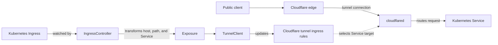
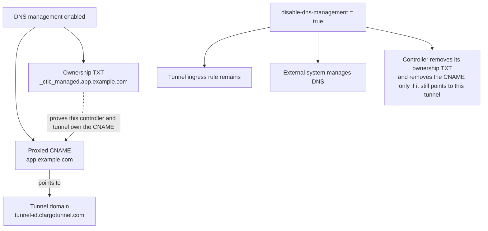

Cloudflare Tunnel Ingress Controller connects two control planes. Kubernetes Ingress resources describe which Services should be exposed, while Cloudflare holds the public DNS records and tunnel routing configuration. The controller continuously translates the Kubernetes view into the Cloudflare view.

Traffic does not pass through the controller itself. The controller manages configuration. The `cloudflared` connectors carry traffic from Cloudflare into the cluster.

## From Ingress to tunnel route

`IngressController` watches Kubernetes Ingress resources and selects those assigned to its Ingress class. When one changes, the controller reads all controlled Ingress resources again. This full view matters because the Cloudflare tunnel configuration is one ordered list of ingress rules, rather than one independent object per Kubernetes Ingress.

An `Exposure` is the internal boundary between Kubernetes and Cloudflare. It holds the public hostname, path prefix, Service target, and origin options. `TunnelClient` turns active Exposures into an ordered rule list, with specific hostnames before wildcards, longer paths before shorter paths, and a final HTTP 404 rule.

The controller stays outside the request path. It writes configuration, while `cloudflared` maintains outbound tunnel connections and forwards public traffic to the Service selected by the matching rule.

See the [Ingress reference](/reference/ingress/) for supported route behavior and validation rules.

## DNS and ownership

The CNAME sends public traffic toward `<tunnel-id>.cfargotunnel.com`. The TXT record gives cleanup a safe ownership boundary, so a matching ownership record is required before normal reconciliation deletes a CNAME.

With `disable-dns-management: "true"`, only DNS responsibility changes. The Exposure still becomes a tunnel rule, but the controller stops creating or updating DNS records and permits hostnames outside its visible Cloudflare zones. When relinquishing records it previously managed, it preserves any CNAME another system has already repointed.

See the [Ingress annotations reference](/reference/ingress-annotations/) for annotation syntax and related origin settings.

## Keeping cloudflared running

`ControlledCloudflaredConnector` is a separate reconciliation loop. After this controller instance becomes the elected leader, the loop runs every 10 seconds. Each pass fetches the tunnel token and compares the managed Kubernetes Secret and Deployment with the desired connector configuration.

The loop creates the connector resources when they do not exist. When they drift, it updates settings such as the image, replica count, command, token Secret version, and pod customization. Kubernetes then rolls out the resulting Deployment changes.

The managed Deployment runs `cloudflared tunnel run` with the tunnel token from the Secret. Those connector pods establish the tunnel connections that carry traffic. Rechecking every 10 seconds makes the connector Deployment self healing even when it is changed independently of an Ingress event.

Connector settings belong in configuration rather than this explanation. See [Controller Configuration](/reference/controller-configuration/) and [Helm Values](/reference/helm-values/) for the available controls.
