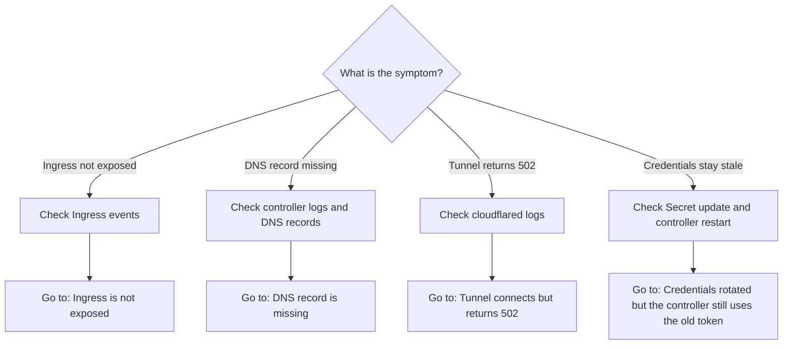
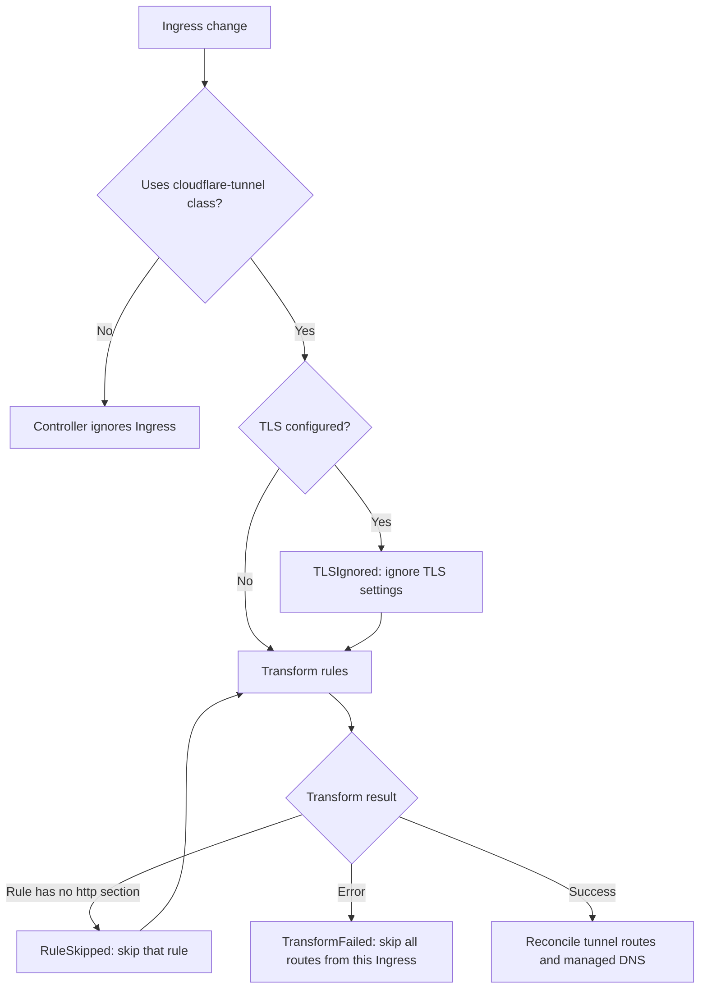

Use this flow to find the right section:



Start by checking that the controller and connector pods are running:

```bash
kubectl get pods -n cloudflare-tunnel-ingress-controller
```

If you used a different Helm release name or namespace, replace them in the commands below.

## Ingress is not exposed

Check that the Ingress uses the `cloudflare-tunnel` class, then inspect its events:

```bash
kubectl get ingress <name> -n <namespace> -o yaml
kubectl describe ingress <name> -n <namespace>
```

The controller reports these warnings:

| Reason            | Event message                                                                     | What to check                                                                                               |
| ----------------- | --------------------------------------------------------------------------------- | ----------------------------------------------------------------------------------------------------------- |
| `RuleSkipped`     | `rule for host <host> has no http section, skipped`                               | Add an `http` section to the rule. Only this rule is skipped.                                               |
| `TLSIgnored`      | `ingress has tls specified, SSL Passthrough is not supported, it will be ignored` | Remove the `tls` section. Cloudflare terminates TLS at the edge.                                            |
| `TransformFailed` | `<transformation error>`                                                          | Fix the error in the event message. All routes from this Ingress are skipped until transformation succeeds. |



Common `TransformFailed` messages:

- `fetch service <namespace>/<service>: ...` when the backend Service does not exist.
- `service <namespace>/<service> has None for cluster ip, headless service is not supported`.
- `service <namespace>/<service> has no port named <port>`.
- `path type in ingress <namespace>/<name> is <pathType>, which is not supported`.

Check controller logs for reconciliation errors:

```bash
kubectl logs deployment/cloudflare-tunnel-ingress-controller \
  -n cloudflare-tunnel-ingress-controller
```

## DNS record is missing

Check the public DNS response, then check controller logs for Cloudflare API, zone, and DNS reconciliation errors:

```bash
dig <hostname>
kubectl logs deployment/cloudflare-tunnel-ingress-controller \
  -n cloudflare-tunnel-ingress-controller
```

Verify that:

- The API token can edit Cloudflare Tunnel and DNS resources and can read the zone.
- The hostname belongs to a zone in the configured Cloudflare account.
- The Ingress does not set [`disable-dns-management: "true"`](/reference/ingress-annotations/#disabling-dns-management).

## Tunnel connects but returns 502

A connected tunnel with a `502` response usually cannot reach the backend Service. Check the Service, port, and ready endpoints:

```bash
kubectl get service <service> -n <namespace>
kubectl get endpointslice -n <namespace> \
  -l kubernetes.io/service-name=<service>
```

Then inspect connector logs for the origin connection error:

```bash
kubectl logs deployment/controlled-cloudflared-connector \
  -n cloudflare-tunnel-ingress-controller
```

If the backend expects HTTPS or a specific host name, verify the relevant [Ingress annotations](/reference/ingress-annotations/).

## Credentials rotated but the controller still uses the old token

The controller reads credentials once at startup. Updating the Secret does not refresh a running controller. Restart the controller after rotating credentials:

```bash
kubectl rollout restart deployment cloudflare-tunnel-ingress-controller \
  -n cloudflare-tunnel-ingress-controller
```

See [Cloudflare credentials](/reference/cloudflare-credentials/) for the full credential setup and rotation caveat.
