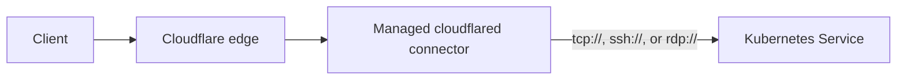

Use the `backend-protocol` annotation when a Kubernetes Service does not speak HTTP.

The controller uses the annotation value as the scheme in the `cloudflared` service URL. For example, `tcp` becomes `tcp://service.namespace.svc.cluster.local:port`, while `ssh` and `rdp` become `ssh://...` and `rdp://...`. The controller passes other schemes through without validation, so confirm that your `cloudflared` version supports the protocol before using it.

See [Ingress annotations](/reference/ingress-annotations/) for the annotation name and default.



## 1. Create one Ingress for the service

Create an Ingress with one host and one backend. This example publishes a PostgreSQL Service over TCP:

```yaml
apiVersion: networking.k8s.io/v1
kind: Ingress
metadata:
  name: postgres-tunnel
  namespace: database
  annotations:
    cloudflare-tunnel-ingress-controller.strrl.dev/backend-protocol: tcp
spec:
  ingressClassName: cloudflare-tunnel
  rules:
    - host: postgres.example.com
      http:
        paths:
          - path: /
            pathType: Prefix
            backend:
              service:
                name: postgres
                port:
                  number: 5432
```

The Kubernetes Ingress API still requires the `http.paths` structure. Use `/` as the placeholder path. The controller omits the path from every tunnel rule whose service URL does not start with `http://` or `https://`.

For SSH, set the annotation value to `ssh` and select the Service port that serves SSH. For RDP, use `rdp` and its Service port.

Keep different backend protocols in separate Ingress resources. The annotation applies to every rule and path in one Ingress.

## 2. Apply the Ingress

```bash
kubectl apply -f postgres-tunnel.yaml
```

## 3. Check reconciliation

Inspect the Ingress for warning events:

```bash
kubectl describe ingress postgres-tunnel -n database
```

Then check the controller log if the Cloudflare route was not accepted:

```bash
kubectl logs deployment/cloudflare-tunnel-ingress-controller \
  -n cloudflare-tunnel-ingress-controller
```

The resulting tunnel rule sends `postgres.example.com` to `tcp://postgres.database.svc.cluster.local:5432` when the cluster domain is the default `cluster.local`.
