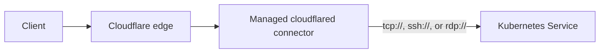
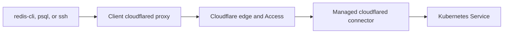

Use the `backend-protocol` annotation when a Kubernetes Service does not speak HTTP.

The controller uses the annotation value as the scheme in the `cloudflared` service URL. For example, `tcp` becomes `tcp://service.namespace.svc.cluster.local:port`, while `ssh` and `rdp` become `ssh://...` and `rdp://...`. The controller passes other schemes through without validation, so confirm that your `cloudflared` version supports the protocol before using it.

See [Ingress annotations](/reference/ingress-annotations/) for the annotation name and default.



## 1. Create one Ingress for the service

Create an Ingress with one host and one backend. This example publishes a PostgreSQL Service over TCP:

```yaml
apiVersion: networking.k8s.io/v1
kind: Ingress
metadata:
  name: postgres-tunnel
  namespace: database
  annotations:
    cloudflare-tunnel-ingress-controller.strrl.dev/backend-protocol: tcp
spec:
  ingressClassName: cloudflare-tunnel
  rules:
    - host: postgres.example.com
      http:
        paths:
          - path: /
            pathType: Prefix
            backend:
              service:
                name: postgres
                port:
                  number: 5432
```

The Kubernetes Ingress API still requires the `http.paths` structure. Use `/` as the placeholder path. The controller omits the path from every tunnel rule whose service URL does not start with `http://` or `https://`.

For SSH, set the annotation value to `ssh` and select the Service port that serves SSH. For RDP, use `rdp` and its Service port.

Keep different backend protocols in separate Ingress resources. The annotation applies to every rule and path in one Ingress.

## 2. Apply the Ingress

```bash
kubectl apply -f postgres-tunnel.yaml
```

## 3. Check reconciliation

Inspect the Ingress for warning events:

```bash
kubectl describe ingress postgres-tunnel -n database
```

Then check the controller log if the Cloudflare route was not accepted:

```bash
kubectl logs deployment/cloudflare-tunnel-ingress-controller \
  -n cloudflare-tunnel-ingress-controller
```

The resulting tunnel rule sends `postgres.example.com` to `tcp://postgres.database.svc.cluster.local:5432` when the cluster domain is the default `cluster.local`.

## Connect from a client

Install [`cloudflared`](https://developers.cloudflare.com/cloudflare-one/networks/connectors/cloudflare-tunnel/downloads/) on every client device that will connect. These commands assume that the hostname is protected by a Cloudflare Access application and policy.



### Connect to Redis

Expose Redis with the same Ingress pattern used above. Set `backend-protocol` to `tcp`, use a host such as `redis.example.com`, and select the Redis Service port `6379`.

Start a local TCP proxy on any available client port:

```bash
cloudflared access tcp \
  --hostname redis.example.com \
  --url localhost:16379
```

Keep that command running. In another terminal, point `redis-cli` at the local port:

```bash
redis-cli -h localhost -p 16379
```

### Connect to PostgreSQL

Start a local proxy for the `postgres.example.com` hostname created earlier:

```bash
cloudflared access tcp \
  --hostname postgres.example.com \
  --url localhost:15432
```

Keep that command running. Connect `psql` to the local port:

```bash
psql \
  --host localhost \
  --port 15432 \
  --username "<DATABASE_USER>" \
  --dbname "<DATABASE_NAME>"
```

See Cloudflare's [arbitrary TCP guide](https://developers.cloudflare.com/cloudflare-one/access-controls/applications/non-http/cloudflared-authentication/arbitrary-tcp/) for Access setup and client authentication details.

### Connect to SSH

Expose the SSH Service with `backend-protocol: ssh`. Add this block to `~/.ssh/config`, replacing the hostname:

```text
Host ssh.example.com
  ProxyCommand cloudflared access ssh --hostname %h
```

If `cloudflared` is not in the SSH client's `PATH`, use its absolute path in `ProxyCommand`.

Connect with the normal SSH command:

```bash
ssh user@ssh.example.com
```

See Cloudflare's [SSH with client side cloudflared guide](https://developers.cloudflare.com/cloudflare-one/networks/connectors/cloudflare-tunnel/use-cases/ssh/ssh-cloudflared-authentication/) for the complete Access setup.

### Use WARP for team access

For managed teams, Cloudflare One Client in WARP mode plus Zero Trust private network routes is an alternative. Users can connect normal client tools to private addresses without starting a hostname specific `cloudflared access` command for each session.

See Cloudflare's [private networks guide](https://developers.cloudflare.com/cloudflare-one/networks/connectors/cloudflare-tunnel/private-net/) for the routing and client enrollment workflow.
