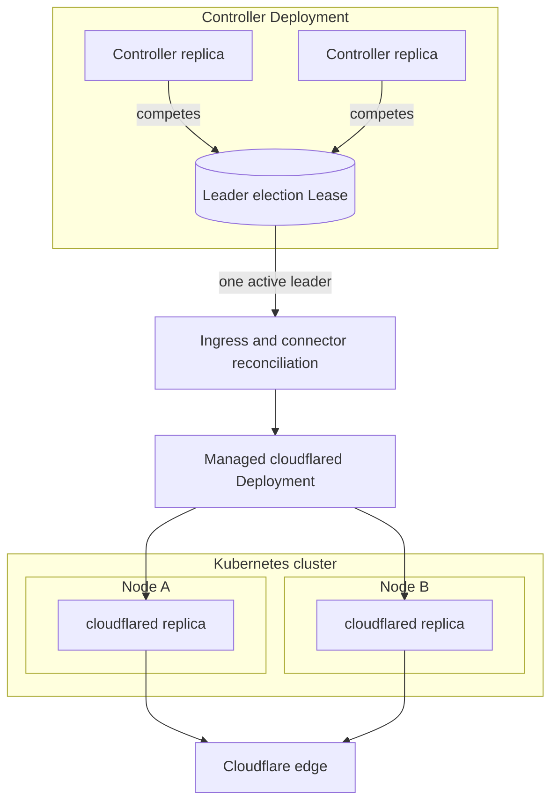

Use multiple controller replicas for reconciliation availability and multiple `cloudflared` replicas for tunnel connectivity.

See [Helm values](/reference/helm-values/) for defaults and the complete chart values file.



## 1. Scale the controller with leader election

Add these values to the values file used for your existing Helm release:

```yaml
replicaCount: 2

leaderElection:
  enabled: true
```

`replicaCount` scales the controller Deployment. `leaderElection.enabled: true` adds the `--leader-elect` flag to every controller pod. That flag enables controller runtime leader election with the lock named `cloudflare-tunnel-ingress-controller.strrl.dev` in the controller namespace.

If you run the binary without Helm, pass `--leader-elect` directly. The Helm value and command flag are two interfaces for the same controller setting.

## 2. Scale and protect cloudflared

Add connector replicas and a PodDisruptionBudget:

```yaml
cloudflared:
  replicaCount: 2
  pdb:
    enabled: true
    minAvailable: 1
```

Use either `minAvailable` or `maxUnavailable`, never both.

## 3. Spread connector pods across nodes

For strict separation by node, enable the chart shortcut:

```yaml
cloudflared:
  podAntiAffinity: true
```

This creates required pod anti affinity on `kubernetes.io/hostname`. The cluster needs at least as many schedulable nodes as connector replicas. Extra replicas remain pending when no eligible node is available.

An explicit `cloudflared.affinity` value takes precedence and disables this shortcut.

## 4. Spread connector pods across zones

Add a topology spread constraint when the cluster labels nodes by zone:

```yaml
cloudflared:
  topologySpreadConstraints:
    - maxSkew: 1
      topologyKey: topology.kubernetes.io/zone
      whenUnsatisfiable: ScheduleAnyway
      labelSelector:
        matchLabels:
          app: controlled-cloudflared-connector
```

You can use this with node anti affinity. Change `whenUnsatisfiable` to `DoNotSchedule` only when every required failure domain has enough schedulable capacity.

## 5. Upgrade the release

Merge these settings into the existing release values, then run your normal Helm upgrade. Do not replace existing Cloudflare credential values with empty chart defaults.

## 6. Verify redundancy

Check the controller Deployment, election lock, connector Deployment, and disruption budget:

```bash
kubectl get deployment cloudflare-tunnel-ingress-controller \
  -n cloudflare-tunnel-ingress-controller

kubectl get lease cloudflare-tunnel-ingress-controller.strrl.dev \
  -n cloudflare-tunnel-ingress-controller

kubectl get deployment controlled-cloudflared-connector \
  -n cloudflare-tunnel-ingress-controller

kubectl get pdb controlled-cloudflared-connector \
  -n cloudflare-tunnel-ingress-controller
```

Confirm all requested replicas are available and connector pods run on the intended nodes or zones.
