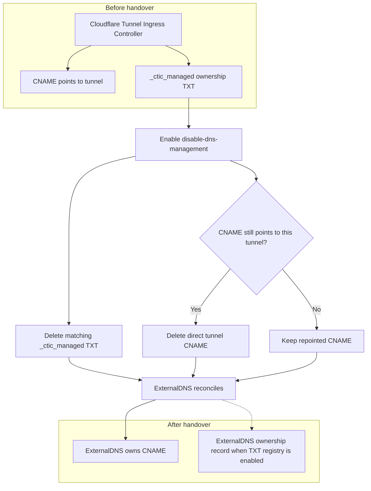

Set `disable-dns-management: "true"` when another system must own DNS while this controller continues to manage the tunnel route.

See [Ingress annotations](/reference/ingress-annotations/) for the annotation reference.

## Before you begin

Find the UUID of the tunnel used by the controller. Its Cloudflare Tunnel target is:

```text
<TUNNEL_ID>.cfargotunnel.com
```

Keep the Ingress in place throughout the handover. The controller still needs it to configure the matching tunnel ingress rule.

## Hand ownership to ExternalDNS



### 1. Disable controller DNS management

Add the annotation to the existing Ingress:

```yaml
metadata:
  annotations:
    cloudflare-tunnel-ingress-controller.strrl.dev/disable-dns-management: "true"
```

Apply the updated manifest:

```bash
kubectl apply -f ingress.yaml
```

On its next reconciliation, the controller deletes its matching `_ctic_managed.<HOSTNAME>` ownership TXT record. It deletes the CNAME only while that record still points to this controller's `<TUNNEL_ID>.cfargotunnel.com` target. A repointed CNAME and records owned by another tunnel stay untouched.

The tunnel ingress rule remains active. A hostname outside every zone available to the controller also stops causing a zone matching error when DNS management is disabled.

### 2. Give ExternalDNS the tunnel target

Configure ExternalDNS with the `ingress` source. Add its target annotation to the same Ingress:

```yaml
metadata:
  annotations:
    cloudflare-tunnel-ingress-controller.strrl.dev/disable-dns-management: "true"
    external-dns.alpha.kubernetes.io/target: "<TUNNEL_ID>.cfargotunnel.com"
```

The host in `spec.rules` supplies the record name. The ExternalDNS target override supplies the CNAME target.

Apply the manifest, then wait for ExternalDNS to create the CNAME:

```bash
kubectl apply -f ingress.yaml
kubectl logs deployment/external-dns -n external-dns
```

Plan a short DNS change window if the controller already owns the same CNAME. Disabling its management can remove that CNAME before ExternalDNS creates its replacement.

### 3. Verify the handover

Check the CNAME:

```bash
dig CNAME <HOSTNAME>
```

Confirm the CNAME targets `<TUNNEL_ID>.cfargotunnel.com`. If ExternalDNS uses its TXT registry, also confirm its configured ownership record exists.

## Put a Cloudflare Load Balancer in front of the tunnel

### 1. Create the Load Balancer origin

Create a Cloudflare Load Balancer pool whose origin address is:

```text
<TUNNEL_ID>.cfargotunnel.com
```

Configure the Load Balancer hostname to match the host in the Kubernetes Ingress.

### 2. Disable controller DNS management

Add `disable-dns-management: "true"` to the Ingress and apply it. If the Load Balancer has already repointed the hostname away from the direct tunnel CNAME, the controller preserves that record and removes only its matching ownership TXT record.

### 3. Verify both routing layers

Confirm the Load Balancer hostname resolves through the expected pool. Keep the Kubernetes Ingress present so the controller continues to route that hostname through the tunnel to the Service.
